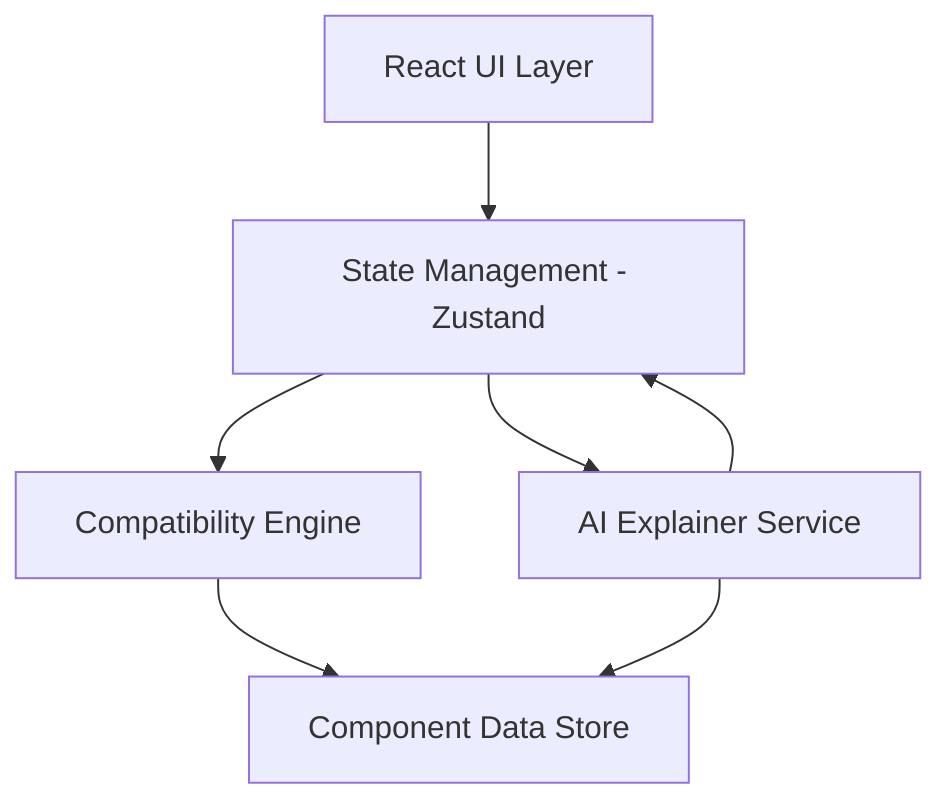

# Design Document: PC Build Assistant

## Overview

The PC Build Assistant is a web-based application that guides users through building a custom PC by presenting compatible component options and explaining trade-offs at each step. The system prioritizes user understanding over automation, ensuring users comprehend the reasoning behind each component choice.

The application uses a React-based frontend with TypeScript for type safety, a compatibility validation engine that enforces hardware constraints, and an AI-powered explanation system that generates natural language descriptions of trade-offs and component relationships.

Key design principles:
- **Compatibility-first**: Invalid component combinations are never shown to users
- **Explainability**: Every recommendation includes clear reasoning
- **User control**: The system assists but never decides for the user
- **Progressive disclosure**: Beginner mode simplifies, Advanced mode reveals details

## Architecture

The system follows a layered architecture with clear separation of concerns:



### Layer Responsibilities

**UI Layer (React Components)**
- Renders component selection interface
- Displays visual PC architecture diagram
- Handles user interactions and mode switching
- Presents AI-generated explanations

**State Management (Zustand)**
- Maintains current build state (selected components, user preferences)
- Manages UI mode (Beginner/Advanced)
- Coordinates between compatibility engine and AI explainer
- Persists build state to local storage

**Compatibility Engine**
- Validates component combinations against hardware rules
- Filters available components based on current selections
- Computes compatibility constraints for next component selection
- Enforces socket types, form factors, power requirements, RAM compatibility

**AI Explainer Service**
- Generates trade-off summaries for component options
- Produces "Why Not This?" explanations
- Answers conversational queries about the build
- Creates final build summary with strengths/weaknesses

**Component Data Store**
- Provides mock component data (CPU, GPU, Motherboard, RAM, Storage, PSU)
- Stores compatibility rules and constraints
- Maintains component specifications (socket types, power draw, form factors)

## Components and Interfaces

### Core Components

#### BuildWizard
Main orchestrator component that manages the step-by-step build process.

```typescript
interface BuildWizardProps {
  mode: 'beginner' | 'advanced';
}

interface BuildWizardState {
  currentStep: ComponentType;
  selectedComponents: PartialBuild;
  userPreferences: UserPreferences;
}
```

#### ComponentSelector
Displays 2-3 compatible component options with trade-off indicators.

```typescript
interface ComponentSelectorProps {
  componentType: ComponentType;
  options: Component[];
  onSelect: (component: Component) => void;
  mode: 'beginner' | 'advanced';
}
```

#### TradeOffDisplay
Shows comparison indicators (cost, performance, power, upgrade path) for component options.

```typescript
interface TradeOffDisplayProps {
  components: Component[];
  tradeOffs: TradeOffMetrics[];
  mode: 'beginner' | 'advanced';
}

interface TradeOffMetrics {
  componentId: string;
  cost: number;
  performance: number;
  powerConsumption: number;
  upgradeability: number;
}
```

#### PCArchitectureVisual
Visual representation of the PC build showing component relationships.

```typescript
interface PCArchitectureVisualProps {
  build: PartialBuild;
  highlightCompatibility: boolean;
}
```

#### AIExplanationPanel
Displays AI-generated explanations and handles conversational queries.

```typescript
interface AIExplanationPanelProps {
  explanation: string;
  onQuery: (query: string) => void;
  mode: 'beginner' | 'advanced';
}
```

#### BuildMetricsDisplay
Shows computed build strategy, budget distribution, and bottleneck analysis.

```typescript
interface BuildMetricsDisplayProps {
  metrics: BuildMetrics;
  mode: 'beginner' | 'advanced';
}

interface BuildMetrics {
  strategy: 'GPU-heavy' | 'CPU-heavy' | 'Balanced' | 'Power-efficient';
  budgetDistribution: Record<ComponentType, number>;
  bottleneckPercentage: number;
  upgradeFlexibility: number;
}
```

### State Management

Using Zustand for lightweight, TypeScript-friendly state management:

```typescript
interface BuildStore {
  // State
  build: PartialBuild;
  preferences: UserPreferences;
  mode: 'beginner' | 'advanced';
  currentStep: ComponentType;
  
  // Actions
  setPreferences: (prefs: UserPreferences) => void;
  selectComponent: (type: ComponentType, component: Component) => void;
  setMode: (mode: 'beginner' | 'advanced') => void;
  nextStep: () => void;
  previousStep: () => void;
  resetBuild: () => void;
}
```

### Compatibility Engine

The compatibility engine validates component combinations using a rule-based system:

```typescript
interface CompatibilityEngine {
  filterCompatibleComponents(
    componentType: ComponentType,
    currentBuild: PartialBuild,
    allComponents: Component[]
  ): Component[];
  
  validateCompatibility(
    component: Component,
    currentBuild: PartialBuild
  ): CompatibilityResult;
  
  getCompatibilityConstraints(
    currentBuild: PartialBuild
  ): CompatibilityConstraints;
}

interface CompatibilityResult {
  isCompatible: boolean;
  violations: CompatibilityViolation[];
}

interface CompatibilityViolation {
  rule: string;
  message: string;
  conflictingComponent?: Component;
}
```

**Compatibility Rules:**

1. **CPU-Motherboard Socket Matching**
   - CPU socket type must match motherboard socket type
   - Examples: LGA 1700, LGA 1200, AM4, AM5

2. **RAM Compatibility**
   - RAM type (DDR4, DDR5) must match motherboard support
   - RAM speed must be within motherboard supported range
   - Total RAM capacity must not exceed motherboard maximum

3. **Form Factor Compatibility**
   - Motherboard form factor must fit case (ATX, Micro-ATX, Mini-ITX)
   - GPU length must fit case clearance
   - CPU cooler height must fit case clearance

4. **Power Supply Validation**
   - PSU wattage must exceed total system power draw + 20% headroom
   - PSU must have required power connectors (PCIe 6-pin, 8-pin, etc.)

5. **Storage Interface Compatibility**
   - M.2 drives require available M.2 slots on motherboard
   - SATA drives require available SATA ports

### AI Explainer Service

The AI explainer generates natural language explanations based on component data and build context:

```typescript
interface AIExplainerService {
  generateTradeOffSummary(
    options: Component[],
    context: BuildContext
  ): string;
  
  generateWhyNotExplanation(
    component: Component,
    selectedComponent: Component,
    context: BuildContext
  ): string;
  
  answerQuery(
    query: string,
    build: PartialBuild,
    preferences: UserPreferences
  ): string;
  
  generateFinalSummary(
    build: CompleteBuild
  ): BuildSummary;
}

interface BuildContext {
  currentBuild: PartialBuild;
  preferences: UserPreferences;
  mode: 'beginner' | 'advanced';
}

interface BuildSummary {
  explanation: string;
  strengths: string[];
  weaknesses: string[];
  useCaseFit: string;
  upgradeRecommendations: UpgradeRecommendation[];
  keyTradeOffs: string[];
}
```

**AI Explanation Strategies:**

- **Trade-off summaries**: Compare components across cost, performance, power, and upgradeability dimensions
- **Why Not explanations**: Reference user preferences and compatibility constraints to explain deprioritization
- **Conversational responses**: Parse user queries, extract intent, and generate context-aware answers
- **Mode-aware language**: Use simplified language for Beginner mode, technical details for Advanced mode

## Data Models

### Component Types

```typescript
type ComponentType = 'CPU' | 'GPU' | 'Motherboard' | 'RAM' | 'Storage' | 'PSU';

interface Component {
  id: string;
  type: ComponentType;
  name: string;
  manufacturer: string;
  price: number;
  specifications: ComponentSpecifications;
}
```

### Component Specifications

```typescript
interface CPUSpecifications {
  socket: string;
  cores: number;
  threads: number;
  baseClock: number;
  boostClock: number;
  tdp: number;
  integratedGraphics: boolean;
}

interface GPUSpecifications {
  vram: number;
  powerDraw: number;
  length: number;
  pciSlots: number;
  powerConnectors: string[];
  performanceScore: number;
}

interface MotherboardSpecifications {
  socket: string;
  formFactor: 'ATX' | 'Micro-ATX' | 'Mini-ITX';
  ramType: 'DDR4' | 'DDR5';
  ramSlots: number;
  maxRamCapacity: number;
  maxRamSpeed: number;
  m2Slots: number;
  sataPorts: number;
  pciSlots: number;
}

interface RAMSpecifications {
  type: 'DDR4' | 'DDR5';
  speed: number;
  capacity: number;
  modules: number;
  latency: string;
}

interface StorageSpecifications {
  type: 'M.2 NVMe' | 'M.2 SATA' | 'SATA SSD' | 'SATA HDD';
  capacity: number;
  readSpeed: number;
  writeSpeed: number;
}

interface PSUSpecifications {
  wattage: number;
  efficiency: '80+ Bronze' | '80+ Silver' | '80+ Gold' | '80+ Platinum' | '80+ Titanium';
  modular: 'Full' | 'Semi' | 'Non';
  connectors: PowerConnectors;
}

interface PowerConnectors {
  pcie6pin: number;
  pcie8pin: number;
  sata: number;
  molex: number;
}
```

### Build Models

```typescript
interface UserPreferences {
  budgetMin: number;
  budgetMax: number;
  useCase: 'gaming' | 'productivity' | 'mixed' | 'content-creation';
  performanceFocus: 'GPU-heavy' | 'CPU-heavy' | 'balanced';
  storageRequirements: 'minimal' | 'moderate' | 'extensive';
  upgradeHorizon: '1-year' | '3-year' | '5-year';
  brandPreferences?: string[];
  powerConstraints?: number;
}

interface PartialBuild {
  cpu?: Component;
  gpu?: Component;
  motherboard?: Component;
  ram?: Component;
  storage?: Component[];
  psu?: Component;
}

interface CompleteBuild extends PartialBuild {
  cpu: Component;
  gpu: Component;
  motherboard: Component;
  ram: Component;
  storage: Component[];
  psu: Component;
}
```

### Compatibility Constraints

```typescript
interface CompatibilityConstraints {
  requiredSocket?: string;
  requiredRamType?: 'DDR4' | 'DDR5';
  maxRamSpeed?: number;
  requiredFormFactor?: string;
  minimumPSUWattage?: number;
  requiredPowerConnectors?: string[];
  availableM2Slots?: number;
  availableSATAPorts?: number;
}
```

## Correctness Properties

*A property is a characteristic or behavior that should hold true across all valid executions of a system—essentially, a formal statement about what the system should do. Properties serve as the bridge between human-readable specifications and machine-verifiable correctness guarantees.*


### Property 1: Preference Validation Completeness
*For any* user preference object with one or more missing required fields, the validation function should reject it and prevent proceeding to component selection.
**Validates: Requirements 1.4**

### Property 2: Preference Persistence Round Trip
*For any* valid user preferences object, saving it and then retrieving it should produce an equivalent preferences object.
**Validates: Requirements 1.5**

### Property 3: Compatibility Filtering Correctness
*For any* build state and component type, all components returned by the compatibility engine must be compatible with all previously selected components according to the compatibility rules.
**Validates: Requirements 2.1, 9.5**

### Property 4: Component Option Count Constraint
*For any* component selection step where at least 3 compatible components exist, the system should present between 2 and 3 options.
**Validates: Requirements 2.2**

### Property 5: Empty Build Uses Only Preferences
*For any* user preferences and component type, when no components have been selected yet, the filtered component list should depend only on the preferences, not on any compatibility constraints.
**Validates: Requirements 2.4**

### Property 6: Component Selection Updates Constraints
*For any* build state and newly selected component that introduces compatibility constraints, the compatibility constraints after selection should differ from the constraints before selection.
**Validates: Requirements 2.5**

### Property 7: Trade-Off Explanation Generation
*For any* set of 2-3 component options, the AI explainer should generate a non-empty explanation that references all the components being compared.
**Validates: Requirements 3.1**

### Property 8: Trade-Off Indicators Presence
*For any* component option displayed to the user, the rendered output should include all four trade-off indicators: cost, performance, power consumption, and upgrade path.
**Validates: Requirements 3.2**

### Property 9: Why Not Explanation Generation
*For any* component option, invoking the "Why not this?" function should return a non-empty explanation string.
**Validates: Requirements 4.1**

### Property 10: Build Metrics Completeness
*For any* build state with at least one selected component, the computed build metrics should contain all required fields: strategy tag, budget distribution, bottleneck percentage, and upgrade flexibility.
**Validates: Requirements 5.1**

### Property 11: Build Strategy Tag Validity
*For any* build state, the assigned strategy tag must be one of: 'GPU-heavy', 'CPU-heavy', 'Balanced', or 'Power-efficient'.
**Validates: Requirements 5.2**

### Property 12: Metrics Recalculation on Change
*For any* build state, changing a component selection should result in different build metrics (except in edge cases where the components have identical specifications).
**Validates: Requirements 5.5**

### Property 13: Visual Representation Updates
*For any* build state, the visual representation component should render without errors and update when any component is selected.
**Validates: Requirements 6.1, 6.2**

### Property 14: Compatibility Status Visualization
*For any* build state, the visual representation should include compatibility status indicators for all component relationships.
**Validates: Requirements 6.3**

### Property 15: Conversational Query Response Generation
*For any* user query string and build state, the AI explainer should generate a non-empty response.
**Validates: Requirements 7.1**

### Property 16: Complete Build Triggers Summary
*For any* build state where all required components (CPU, GPU, Motherboard, RAM, Storage, PSU) are selected, the system should generate a final build summary.
**Validates: Requirements 8.1**

### Property 17: Build Summary Completeness
*For any* complete build, the generated summary should contain all required sections: explanation, strengths, weaknesses, use-case fit, upgrade recommendations, and key trade-offs.
**Validates: Requirements 8.2, 8.3, 8.4**

### Property 18: Final Visual Completeness
*For any* complete build, the final visual representation should display all selected components and highlight the build strategy visually.
**Validates: Requirements 8.6, 8.7**

### Property 19: CPU-Motherboard Socket Compatibility
*For any* CPU and Motherboard, if their socket types do not match, the compatibility engine should mark them as incompatible.
**Validates: Requirements 9.1**

### Property 20: RAM-Motherboard Type Compatibility
*For any* RAM and Motherboard, if the RAM type does not match the motherboard's supported RAM type, or if the RAM speed exceeds the motherboard's maximum supported speed, the compatibility engine should mark them as incompatible.
**Validates: Requirements 9.2**

### Property 21: PSU Wattage Sufficiency
*For any* build state, if the PSU wattage is less than the total power draw of all components plus 20% headroom, the compatibility engine should mark the PSU as incompatible.
**Validates: Requirements 9.3**

### Property 22: Form Factor Compatibility
*For any* components with form factor constraints (motherboard size, GPU length, cooler height), if the physical dimensions are incompatible, the compatibility engine should mark them as incompatible.
**Validates: Requirements 9.4**

### Property 23: Build State Persistence Round Trip
*For any* build state with selected components, persisting the state and then restoring it should produce an equivalent build state with all components, preferences, and metrics intact.
**Validates: Requirements 10.1, 10.2, 10.3, 10.4**

### Property 24: Persisted Data Completeness
*For any* build state that is persisted, the persisted data should contain all three required sections: component selections, user preferences, and build metrics.
**Validates: Requirements 10.3**

## Error Handling

The system must handle errors gracefully to maintain user trust and prevent invalid states:

### Compatibility Engine Errors
- **Invalid component data**: If component specifications are missing or malformed, log error and exclude component from options
- **Constraint conflicts**: If no compatible components exist for a selection step, display message explaining the constraint conflict and allow user to backtrack
- **Validation failures**: If a component passes initial filtering but fails detailed validation, prevent selection and show specific violation message

### AI Explainer Errors
- **API failures**: If AI service is unavailable, display cached/template explanations with reduced detail
- **Timeout errors**: If explanation generation exceeds timeout (5 seconds), display loading state then fallback explanation
- **Invalid responses**: If AI generates malformed output, sanitize and display partial explanation or fallback message

### State Management Errors
- **Persistence failures**: If local storage is full or unavailable, warn user and continue with in-memory state only
- **Restoration failures**: If persisted state is corrupted, reset to empty build and log error
- **Concurrent modifications**: Use optimistic locking to prevent race conditions in state updates

### UI Errors
- **Rendering failures**: Wrap components in error boundaries to prevent full app crashes
- **Network errors**: Display retry options for any network-dependent features
- **Browser compatibility**: Detect unsupported features and display graceful degradation messages

## Testing Strategy

The PC Build Assistant will use a dual testing approach combining unit tests and property-based tests to ensure comprehensive coverage and correctness.

### Property-Based Testing

Property-based testing will validate universal properties across all inputs using the **fast-check** library for TypeScript. Fast-check is a mature property-based testing framework that integrates seamlessly with Jest and provides powerful generators for complex data structures.

**Configuration:**
- Minimum 100 iterations per property test
- Each property test must reference its design document property using the tag format:
  - `// Feature: pc-build-assistant, Property N: [property text]`

**Key Property Tests:**

1. **Compatibility Properties** (Properties 3, 19-22)
   - Generate random component combinations
   - Verify compatibility engine correctly identifies valid/invalid combinations
   - Test all compatibility rules: socket matching, RAM compatibility, PSU wattage, form factors

2. **Round-Trip Properties** (Properties 2, 23, 24)
   - Generate random preference objects and build states
   - Verify persistence and restoration preserve all data
   - Test serialization/deserialization correctness

3. **Invariant Properties** (Properties 10, 11, 14, 17, 24)
   - Generate random build states
   - Verify computed metrics always contain required fields
   - Verify strategy tags are always valid values
   - Verify visual representations always include required elements

4. **Filtering Properties** (Properties 3, 4, 5)
   - Generate random build states and component databases
   - Verify filtered components are always compatible
   - Verify option counts stay within bounds
   - Verify empty builds filter by preferences only

5. **State Update Properties** (Properties 6, 12, 13)
   - Generate random component selections
   - Verify state updates propagate correctly
   - Verify metrics recalculate on changes
   - Verify UI updates reflect state changes

**Custom Generators:**

The test suite will include custom fast-check generators for domain objects:

```typescript
// Generate valid component specifications
const cpuArbitrary = fc.record({
  socket: fc.constantFrom('LGA 1700', 'LGA 1200', 'AM4', 'AM5'),
  cores: fc.integer({ min: 4, max: 32 }),
  tdp: fc.integer({ min: 65, max: 250 }),
  // ... other fields
});

// Generate valid build states
const buildStateArbitrary = fc.record({
  cpu: fc.option(cpuArbitrary),
  gpu: fc.option(gpuArbitrary),
  // ... other components
});

// Generate user preferences
const preferencesArbitrary = fc.record({
  budgetMin: fc.integer({ min: 500, max: 2000 }),
  budgetMax: fc.integer({ min: 2000, max: 10000 }),
  useCase: fc.constantFrom('gaming', 'productivity', 'mixed', 'content-creation'),
  // ... other fields
});
```

### Unit Testing

Unit tests will verify specific examples, edge cases, and integration points using Jest and React Testing Library.

**Focus Areas:**

1. **Specific Examples**
   - Test known component combinations (e.g., Intel i9 + Z790 motherboard)
   - Test specific user preference scenarios
   - Test component selection order (Property 2.3)
   - Test mode-specific UI rendering (Requirements 1.2, 1.3)

2. **Edge Cases**
   - Empty build state
   - Single component selected
   - All components selected (complete build)
   - Budget constraints with no compatible options
   - Maximum RAM capacity scenarios
   - Minimum PSU wattage scenarios

3. **Integration Points**
   - Component selector integration with compatibility engine
   - AI explainer integration with build state
   - Visual representation integration with build updates
   - Persistence layer integration with state management

4. **Error Conditions**
   - Invalid component data
   - Missing required fields
   - API failures and timeouts
   - Storage quota exceeded
   - Corrupted persisted state

**Test Organization:**

```
src/
  components/
    BuildWizard.test.tsx
    ComponentSelector.test.tsx
    PCArchitectureVisual.test.tsx
  services/
    compatibilityEngine.test.ts
    compatibilityEngine.property.test.ts
    aiExplainer.test.ts
  store/
    buildStore.test.ts
    buildStore.property.test.ts
```

### Testing Balance

- **Property tests** handle comprehensive input coverage through randomization
- **Unit tests** focus on specific examples, edge cases, and integration scenarios
- Both approaches are complementary and necessary for high confidence in correctness
- Property tests catch unexpected bugs across the input space
- Unit tests validate specific behaviors and document expected usage patterns

### Continuous Integration

All tests (unit and property) will run on every commit:
- Fast-check property tests with 100 iterations in CI
- Increase to 1000 iterations for release builds
- Track property test failures and shrink to minimal counterexamples
- Maintain test coverage above 80% for core logic
